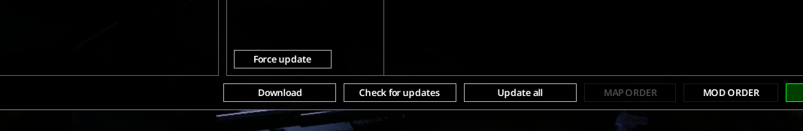
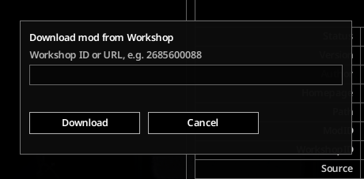

# WorkshopBridge

Download and update Steam Workshop mods from inside Project Zomboid. Built for non-Steam (GOG) players who can't use the Steam Workshop directly.

A Lua UI in the Mods menu ("Check for updates", "Update all", per-mod "Update", "Download") talks to a Java backend (via [ZombieBuddy](https://github.com/zed-0xff/ZombieBuddy)) that runs `steamcmd`, moves downloaded mods into place, and remembers which workshop item each mod came from.

## Usage

- **Check for updates** scans the workshop for newer versions of your tracked mods. Nothing is automatic; checks only run when you ask, so a surprise update can't break your save.
- **Update all (N)** downloads and installs every available update. **Update** / **Force update** on a single mod does the same for one item (it always re-downloads, never checks first).
- **Download** grabs a brand-new mod: paste a workshop ID or URL.
- **More tools**: export your enabled mods as a list of workshop links, import mods from pasted text, or import a whole workshop collection.
- **Adopt...** (on mods showing "Unknown workshop ID"): link a manually installed mod to its workshop item. It re-downloads the item, verifies it actually contains your mod, then tracks it for updates.
- Downloads run one at a time; a waiting one shows "Queued...". Long operations show a progress panel. If the network is down you get a plain-English message, not a raw exception.

## Recommended Mods

- [Mod Folders](https://steamcommunity.com/sharedfiles/filedetails/?id=3779201168)
- [Enable Reset Lua Button](https://steamcommunity.com/sharedfiles/filedetails/?id=3487511907)

## Docs

- [Installation](docs/INSTALL.md) - ZombieBuddy setup, installing the mod, steamcmd options, Windows notes, troubleshooting
- [Building](WorkshopBridge/java-src/README.md) - compile the Java backend with Gradle
- [Architecture](docs/ARCHITECTURE.md) - Lua/Java contract, data flows, map format, how the check/update/download/adopt flows work
- [Testing](docs/TESTING.md) - how to run the offline suites and the online smoke test

## License

MIT, see [LICENSE](LICENSE).

---

Disclaimer: Vibecoded, Most of the source code manually reviewed and tweaked , but still. 
